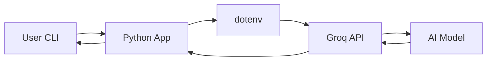

<div align="center">


<br><br>

# 🚗 Autonomous Vehicle AI Chatbot

### *The Definitive Academic & Professional Assistant for Self-Driving Technology*

<br>

   

<br><br>

<p>
<b>An expert-level AI assistant specialized in Autonomous Vehicle systems.</b><br>
Designed to deliver structured, accurate, and professional explanations for academic and technical use.
</p>

<br>

[Quick Start](#-quick-start) • [Key Features](#-key-features) • [Technical Expertise](#-technical-expertise) • [Architecture](#-architecture)

</div>

---

## 📖 Overview

The **Autonomous Vehicle AI Chatbot** is a domain-specific intelligent assistant designed for students, researchers, and engineers working in self-driving technology.

It provides deep insights into:

- Sensor systems (LiDAR, Radar, Cameras)  
- Localization (SLAM, GPS, IMU)  
- Path planning algorithms   

It acts as a **virtual professor**, simplifying complex topics into structured explanations.

---

## ✨ Key Features

- 🎓 Academic Tone  
- 📊 Structured Responses  
- ⚡ Fast AI Inference (Groq)  
- 🧠 SAE Levels (0–5)  
- 🔄 Context Memory   

---

## 🔬 Technical Expertise

| Category | Topics Covered |
| :--- | :--- |
| Perception | LiDAR, Radar, Vision |
| Localization | SLAM, GPS, IMU |
| Planning | A*, Dijkstra |
| Hardware | Sensor Fusion, ECU |
| Safety | Ethics, Fail-safe |

---

## 🏗️ Architecture



---

## 🚀 Quick Start

### 1. Prerequisites
- Python 3.8+
- [Groq AI API Key](https://console.groq.com/keys)

### 2. Installation

```bash
# Clone the repository
git clone https://github.com/BiswajithPN/AI-Chatbot.git
cd AI-Chatbot

# Install dependencies
pip install -r requirements.txt
```

### 3. Configuration

Create a `.env` file in the root directory:

```env
GROQ_API_KEY=your_actual_api_key_here
```

### 4. Run the Application

```bash
python app.py
```

### 5. Access the Interface

Open your browser and navigate to:
```
http://localhost:5000
```

---

## 🎯 Example Interactions

Try these questions to explore the AI's capabilities:

### **SAE Levels**
- "What are the main differences between SAE Level 2 and Level 3 autonomy?"
- "How does SAE Level 5 full autonomy work?"

### **Sensor Technology**
- "Compare LiDAR vs Radar sensors for autonomous vehicles"
- "How does sensor fusion work in self-driving cars?"

### **Industry Analysis**
- "Compare Tesla's FSD approach vs Waymo's strategy"
- "Explain Tesla's neural network architecture"

### **Algorithms & Planning**
- "How does A* path planning work in autonomous vehicles?"
- "Explain the challenges in motion planning for AVs"

---

## 🛠️ Troubleshooting

### Common Issues

**API Key Error:**
```
Error: GROQ_API_KEY not found in .env file
```
**Solution:** Ensure your `.env` file contains a valid Groq API key.

**Connection Error:**
```
Unable to reach AV Intelligence servers
```
**Solution:** Check your internet connection and API key validity.

---

## 📁 Project Structure

```
AI-Chatbot/
├── assets/
│   └── banner.png        # Project banner image
├── templates/
│   └── index.html        # Main web interface
├── app.py                # Main Flask application
├── requirements.txt      # Python dependencies
├── .env                  # Environment variables
├── .gitignore           # Git ignore rules
└── README.md            # This file
```

---

## 🔧 Technical Details

### Backend
- **Framework**: Flask (Python)
- **AI Provider**: Groq API
- **Model**: Optimized for autonomous vehicle discussions
- **Response Format**: Structured markdown with enhanced styling

### Frontend
- **Framework**: Vanilla JavaScript with Tailwind CSS
- **Design**: Modern, professional interface
- **Features**: Real-time chat, typing indicators, mobile responsive
- **Mobile**: Touch-optimized with slide-out navigation

---

## 🤝 Contributing

We welcome contributions! Please feel free to:
- Report bugs
- Suggest new features
- Submit pull requests
- Improve documentation

---

## 📄 License

This project is licensed under the MIT License - see the [LICENSE](LICENSE) file for details.

---

<div align="center">

**Built with ❤️ for the Autonomous Vehicle Community**

*Advancing the future of transportation, one conversation at a time.*

🚗 **[Get Started](#-quick-start)** • 🌟 **[Star this repo](https://github.com/BiswajithPN/AI-Chatbot)** • 🐛 **[Report Issues](https://github.com/BiswajithPN/AI-Chatbot/issues)**

</div>