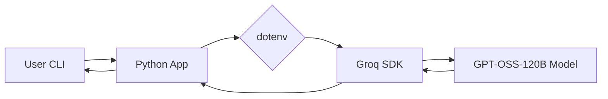

<div align="center">

<!--  -->

# 🚀 Autonomous Vehicle AI Chatbot

### *The Definitive Academic & Professional Assistant for Self-Driving Technology*

[](https://www.python.org/)
[](https://groq.com/)
[](LICENSE)

---

<p align="center">
<b>An expert-level AI assistant specialized in the field of Autonomous Vehicles.</b><br>
Built to deliver clear, accurate, and highly detailed answers with a professional, academic tone.
</p>

[Quick Start](#-quick-start) • [Key Features](#-key-features) • [Technical Expertise](#-technical-expertise) • [Architecture](#-architecture)

</div>

---

## 📖 Overview

The **Autonomous Vehicle AI Chatbot** is a specialized tool designed for students, researchers, and engineers working in the autonomy space. Leveraging the high-performance **Groq API** and the **GPT-OSS-120B** model, it provides deep insights into the complex world of self-driving cars—ranging from hardware sensor stacks to high-level path planning logic.

Whether you're preparing for a technical interview at Waymo or Tesla, or studying for a university exam on **Sensor Fusion**, this assistant acts as your personal professor, breaking down complex topics into structured, easy-to-digest formats.

---

## ✨ Key Features

- **🎓 Academic Tone**: Delivers expert-level explanations suitable for professional environments.
- **📊 Structured Responses**: Uses Markdown tables, clear headings, and bullet points for complex comparisons.
- **🛠️ High-Speed Inference**: Powered by Groq's LPU™ Inference Engine for near-instant responses.
- **🧠 SAE Specialty**: Comprehensive knowledge of SAE Levels of driving automation (0-5).
- **🛤️ Contextual Memory**: Maintains conversation history for coherent, multi-turn discussions.

---

## 🔬 Technical Expertise

The chatbot is specifically fine-tuned (via system prompt engineering) to guide users through:

| Category | Topics Covered |
| :--- | :--- |
| **Perception** | LiDAR, Radar, Ultrasonic, Computer Vision, YOLO, Image Segmentation. |
| **Localization** | SLAM, GPS/GNSS, IMU, HD Maps. |
| **Logic/Planning** | A* Search, Dijkstra, Markov Decision Processes, Path Integration. |
| **Hardware** | Sensor Fusion, CAN Bus, ECU, NVIDIA Drive, Tesla FSD Hardware. |
| **Ethics & Safety** | Moral Machine, Fail-safe vs. Fail-operational, Regulatory Standards. |

---

## 🏗️ Architecture



---

## 🚀 Quick Start

### 1. Prerequisites
- Python 3.8+
- [Groq AI API Key](https://console.groq.com/keys)

### 2. Installation

```bash
# Clone the repository
git clone https://github.com/BiswajithPN/AI-Chatbot.git
cd AI-Chatbot

# Install dependencies
pip install -r requirements.txt
```

### 3. Configuration

Create a `.env` file in the root directory:

```env
GROQ_API_KEY=your_actual_api_key_here
```

### 4. Run the Chatbot

```bash
python app.py
```

---

<div align="center">

<p>Developed with ❤️ by <b>BiswajithPN</b></p>

<p>Stay safe on the road, even if it's autonomous!</p>

</div>