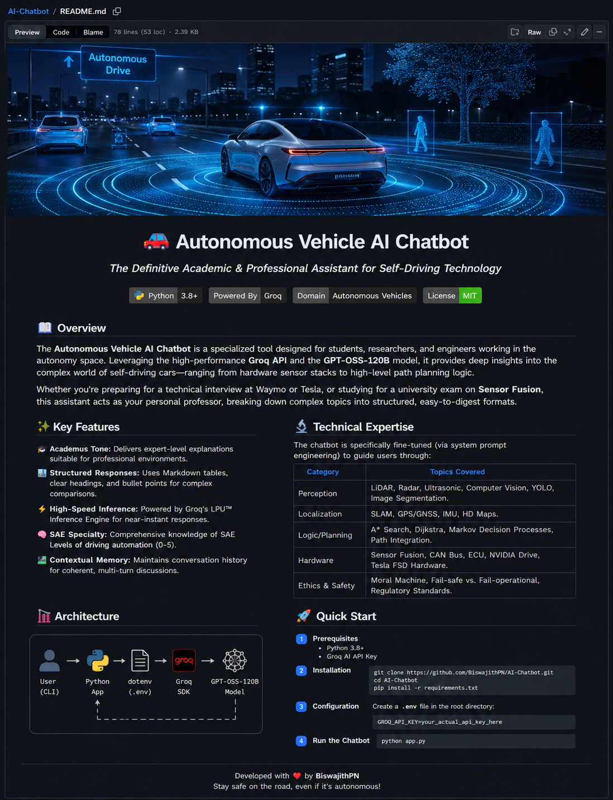

<div align="center">



<br><br>

# 🚗 Autonomous Vehicle AI Chatbot

### *The Definitive Academic & Professional Assistant for Self-Driving Technology*

<br>

<a href="https://biswajith-ai.vercel.app/" target="_blank">
  
</a>

<br><br>


<br>

<p align="center">
<b>An expert-level AI assistant specialized in Autonomous Vehicle technology.</b><br>
Built to deliver clear, accurate, and highly detailed answers with professional styling.
</p>

### 👨‍💻 Built by **Biswajith PN**
*Passionate about AI, building intelligent systems, and shaping the future of autonomous technology.*

<br>

[🚀 Live Demo](https://biswajith-ai.vercel.app/) • [Quick Start](#-quick-start) • [Features](#-features) • [Technical Expertise](#-technical-expertise)

</div>

---

## 📖 Overview

The **Autonomous Vehicle AI Chatbot** is a specialized tool designed for students, researchers, and engineers working in the autonomy space. Leveraging the high-performance **Groq API**, it provides deep insights into the complex world of self-driving cars.

Whether you're preparing for a technical interview at Waymo or Tesla, or studying for a university exam on **Sensor Fusion**, this assistant acts as your personal professor with a beautiful, modern interface.

---

## ✨ Features

### 🎨 **Premium Web Interface**
- **Modern Design**: Clean, professional interface with glassmorphism effects
- **Mobile Responsive**: Touch-optimized with slide-out navigation
- **Real-time Chat**: Smooth animations and typing indicators
- **Dark Theme**: Easy on the eyes with cyan accent colors

### 🧠 **AI Capabilities**
- **AV-Exclusive Focus**: Only discusses autonomous vehicle topics
- **Expert Knowledge**: Deep understanding of SAE levels, sensors, algorithms
- **Structured Responses**: Well-formatted answers with headings, lists, and tables
- **High-Speed Processing**: Powered by Groq's LPU™ technology

### 🛠️ **Technical Features**
- **Flask Backend**: Robust Python web application
- **Error Handling**: Graceful error management and user feedback
- **Session Management**: Individual chat sessions for multiple users
- **Clean Architecture**: Well-organized, maintainable code

---

## 🔬 Technical Expertise

The AI specializes exclusively in:

| Category | Coverage |
|----------|----------|
| **SAE Levels** | Levels 0-5 definitions, differences, real-world implementations |
| **Sensors** | LiDAR, Radar, Cameras, Ultrasonic, Sensor Fusion |
| **Algorithms** | Path Planning (A*, RRT), Computer Vision, Machine Learning |
| **Companies** | Tesla FSD, Waymo, Cruise, Aurora analysis |
| **Safety & Ethics** | Functional safety, ethical decision making, regulations |
| **Hardware** | NVIDIA Drive, processing units, vehicle integration |

---

## 🚀 Quick Start

### Prerequisites
- **Python 3.8+**
- **Groq API Key** ([Get free key](https://console.groq.com/keys))

### Installation

```bash
git clone https://github.com/BiswajithPN/AI-Chatbot.git
cd AI-Chatbot
pip install flask groq python-dotenv
